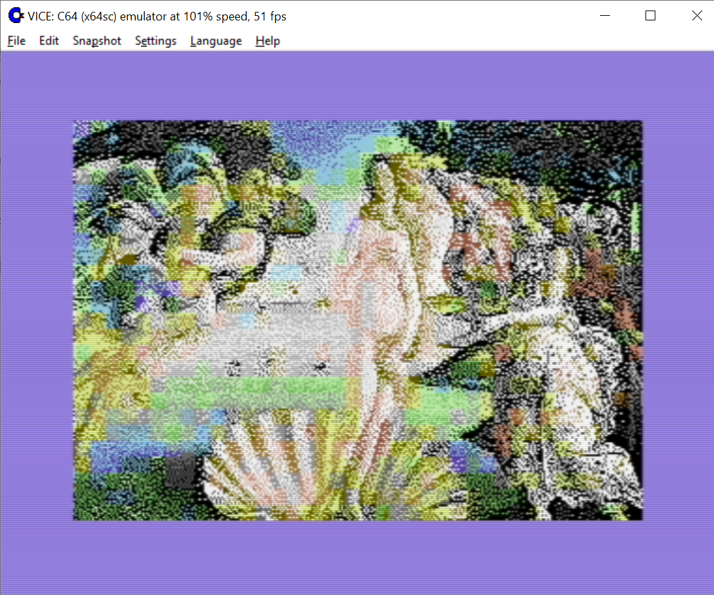
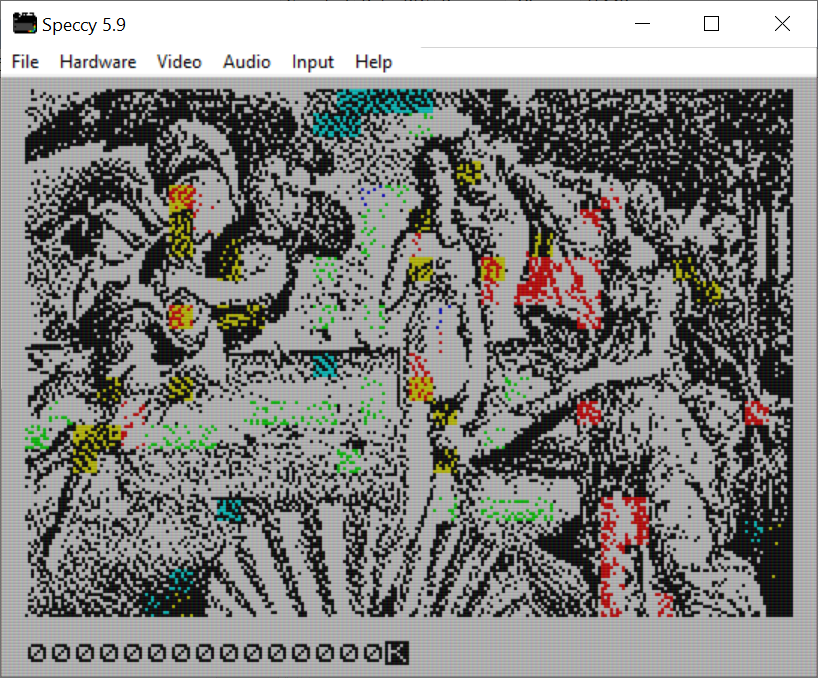
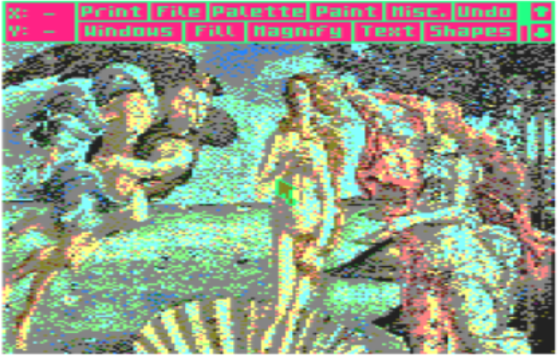
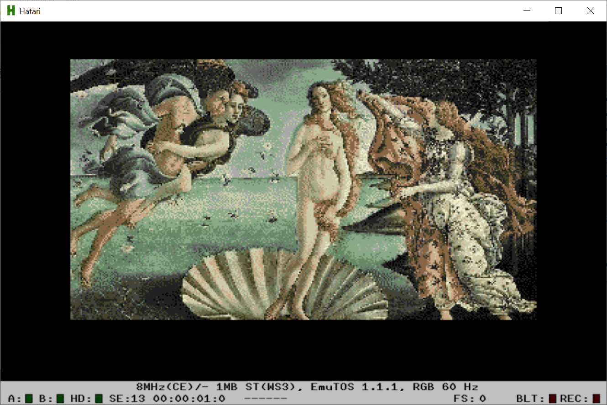
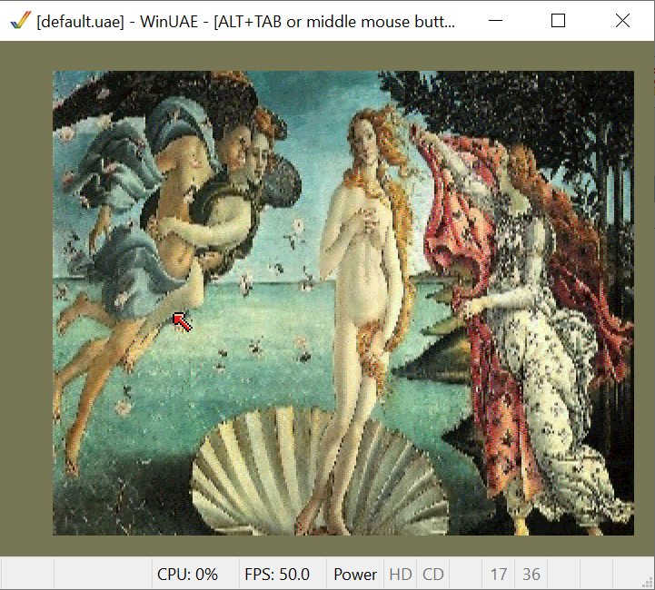

# RetroPIC

RetroPIC is a simple graphics converter for retro machines. It can turn your modern picture into a retro graphic, displayed on real C64 or Amiga.

Accepts JPG, PNG file formats and RGB, BGR pixel formats.

You can download executable jar [here|retropic.jar]

## Supported machines

* C64, hires, multicolor.
* ZX Spectrum 48/+.
* Amstrad CPC series mode0, mode1.
* Atari ST, 320x200 in 16 on screen from 512 palette colors.
* Amiga 500/1000, PAL 320x256 in 32 colors or in HAM6 encoding, 4096 palette colors.

## Graphics formats

* PRG, Koala Paint, ArtStudio for C64
* ZX SCR format
* ArtStudio for CPC machines
* DEGAS for Atari
* IFF format for Delux Paint – Amiga

## Conversion options

Try all options available.

* Color distance – how color distance in the RGB cube is measured: euclidean, redmean simple approximation (percepted), picks highest luminance color.

### Commodore C64

16 colors total, 4 modes, 2 usefull for graphics.

* VIVID – first pass dithering, colors of the original picture are replaced by retro machine palette, dithered.

* 320x200 - use 2 colors in 8x8 screen cell.
* 160x200 - use 4 colors in 4x8 screen cell, average or brightest color are choosen when shrinking to 320->160.

Exports to executable PRG or to Art Studio (hires) and Koala Paint (multicolor).

### ZX Spectrum 48/+

8 colors total, 1 screen mode.

* try REAL colors - produces more tinty picture insted of hue explosion :)

* 256x192 - use 2 colors in 8x8 screen cell

Exports to native SCR snapshoot.

### Amstrad CPC

27 colors total, 3 modes, 2 usefull.

* dithering – first pass dithering, colors of the original picture are replaced by retro machine palette
* replace brightest - replaces brightest color with dimmed yellow

* 320x200 - use 4 colors on whole screen
* 160x200 - use 16 colors on whole screen, average or brightest color are choosen when shrinking to 320->160

Export to Advanced Art Studio with standalone palette file. All files generated with AMSDOS headers.

### Atari ST

512 colors total, 3 modes, 2 usefull for graphics.

* VIVID – first pass dithering, colors of the original picture are replaced by retro machine palette, dithered.
* adjust contrast - gives more or less contrast - replaces colors.

* 320x200 - use 16 colors, palette is result of Kohonen pixel classification.

Export to DEGAS paint program.

### Amiga 500

4096 colors total, 2 modes usefull for graphics.

* VIVID – first pass dithering, colors of the original picture are replaced by retro machine palette, dithered.
* adjust contrast - gives more or less contrast - replaces colors.

* 320x256 - use 32 colors, palette is result of Kohonen pixel classification.
* 320x256 - use HAM coding, 16 color palette as a result of Kohonen classification, best neuron takes all.

Export to Delux Paint IFF file format.

