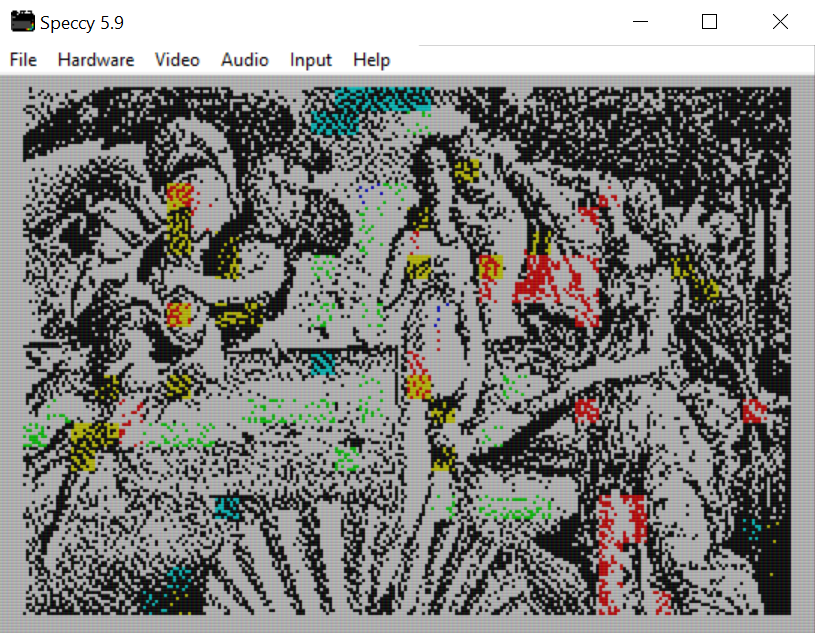
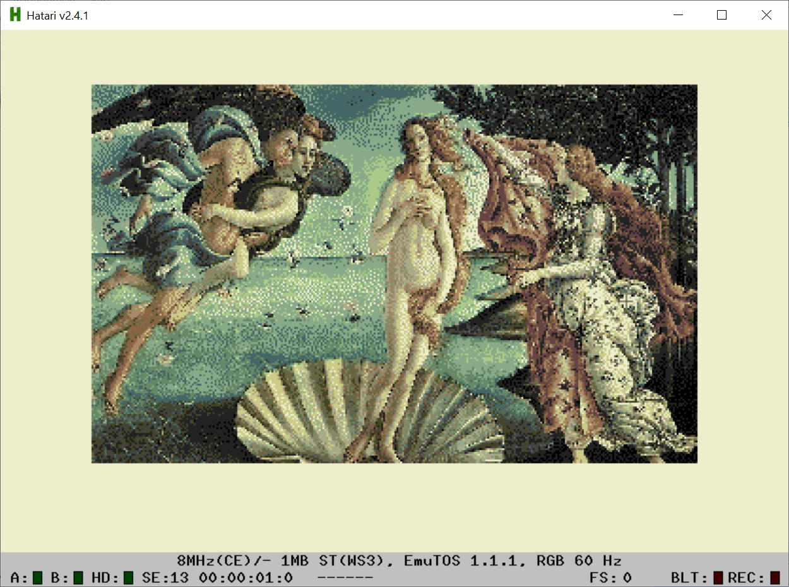

# RetroPIC

RetroPIC is a simple graphics converter for retro machines. It can turn your modern picture into a retro graphic which can be displayed on real C64 or Amiga. Just drag and drop your picture on the machine options panel.

Accepts JPG, PNG file formats and RGB, BGR pixel formats.

You can download executable jar [here](retropic.jar).

Requirements: JRE16 installed.

## Versions

* 1.2 - Improved palette & color handling for C64, CPC, Amiga 500, experimental C64 extra 
* 1.1 - Minor bug fixes, CPC new palette
* 1.0 - Minor changes, time to start versioning
* 0.1 - Initial version, bug fixes

## Supported machines

* C64, hires 320x200, multicolor 160x200, standard text mode 40x25, interlaced, MCI (first atempt, unworking yet)
* ZX Spectrum 48/+ 256x192 in 16 colors.
* Amstrad CPC series mode0 160x200 16 colors, mode1 320x200 in 4 colors.
* Atari ST, 320x200 in 16 on screen from 512 palette colors.
* Amiga 500/1000, PAL 320x256 and 320x512 in 32 colors or in HAM6 encoding, 4096 palette colors.
* Amiga 1200/4000, PAL 320x256, 320x512, 640x512 in 256 colors or in HAM8 encoding, 16M palette colors.

## Graphics formats

* executable PRG, Koala Paint, ArtStudio for C64
* ZX SCR format
* ArtStudio for CPC machines
* DEGAS for Atari
* IFF format for Delux Paint – Amiga (RLE option)

## Conversion options

Try all options available.

* Dithering - pictures are dithered using Floyds-Steinberg or Atkinson algorythms.
* Color distance – how color distance in the RGB cube is measured: euclidean, redmean simple approximation (close to human perception), picking highest luminance color.
* Contrast processing - experimental luma histogram equalizer designed for 8 bit machines primarly, now enabled for every available machine. HE - standard global equalization, CLAHE & SWAHE - clipped local equalization, first fast method for local contrast enhancer, second slow but for more demanding.

### Commodore C64

16 colors total, 4 modes, 2 usefull for graphics

* 320x200 - use 2 colors in 8x8 screen cell.
* 160x200 - use 4 colors in 4x8 screen cell, average or brightest color are choosen when shrinking 320->160.

Exports to executable PRG or to Art Studio (hires) and Koala Paint (multicolor).

### PETSCII

16 foreground colors, 1 common background color for every character on the screen. Orginal PETSCII characterset.

* One hidden layer, sigmoid activation - neural net character matcher with single hidden layer, preffers semigraphics.
* Two hidden layers, sigmoid activation - neural net character matcher with two hidden layers, preffers characters.

Exports to executable PRG.

### ZX Spectrum 48/+

8 colors total, 1 screen mode.

* try apple dithering - produces more tinty picture insted of hue explosion.
* 256x192 - use 2 colors in 8x8 screen cell.

Exports to native SCR snapshoot.

### Amstrad CPC

27 colors total, 3 modes, 2 usefull.

* dithering – Atkinson dithering, colors of the original picture are replaced by retro machine palette
* replace brightest - replaces brightest color with dimmed yellow

* 320x200 - use 4 colors on whole screen.
* 160x200 - use 16 colors on whole screen, average or brightest color are choosen when shrinking 320->160.

Palette is result of Kohonen pixel classification. Exports to Advanced Art Studio with standalone palette file. All files generated with AMSDOS headers.

### Atari ST

* 320x200 - use 16 colors, palette is result of Kohonen pixel classification.

Export to DEGAS paint program.

### Amiga 500

4096 colors total, 4 modes usefull for graphics.

* 320x256, 320x512 (lace) - use 32 colors, palette is result of Kohonen pixel classification.
* 320x256, 320x512 (lace) - use HAM6 coding, 16 color palette as a result of Kohonen classification.
* export with RLE compression - use RLE compression run1byte.

Export to Delux Paint IFF file format.

### Amiga 1200

16M colors total, 2 modes usefull for graphics.

* 320x256, 320x512 (lace), 640x512 (lace) - use 256 colors, palette is result of Kohonen pixel classification.
* 320x256, 320x512 (lace), 640x512 (lace) - use HAM8 coding, 64 color palette as a result of Kohonen classification.
* export with RLE compression - use RLE compression run1byte.

Export to Delux Paint IFF file format.

### Commodore C64 extra

Early, experimental interlaced modes. You can select max luma difference in blending colors together.

* Naive 320x200 - use max 4 colors in 8x8 screen cell, 27-54 colors can be used without annoying flickering.
* MCI 320x200 - use max 16 colors in 8x8 screen cell. Not usable yet. Very early stage, only a few suitable pictures can be converted. They must be dark or monochrome.
* luma threshold - interlace is about blending, only colors with the same luminance can produce non flickering new color. White has 32 black is 0, choose luminance difference which is not annoying.

Exports to executable PRG. In the future release one of the standard format will be supported (for editing).

