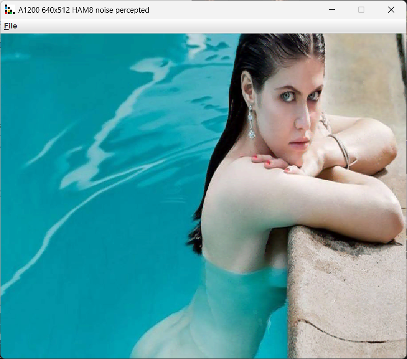

### Amiga 500

4096 colors total, 4 modes useful for graphics.

* 320x256, 320x512 (lace) - uses 32 colors, palette is result of Kohonen pixel classification.
* 320x256, 320x512 (lace) - uses HAM6 coding, 16 color palette as a result of Kohonen classification.
* export with RLE compression - use RLE compression run1byte.

Monochrome 32 shades of grey. Use this mode for monochrome monitors. Use luminance color distance and pal/bw switch. 

### Amiga 1200

16M colors total, 4 modes useful for graphics.

* 320x256, 320x512 (lace), 640x512 (lace) - uses 256 colors, palette is result of Kohonen pixel classification.
* 320x256, 320x512 (lace), 640x512 (lace) - uses HAM8 coding, 64 color palette as a result of Kohonen classification.
* export with RLE compression - use RLE compression run1byte.

Export to Delux Paint IFF file format. Blue noise works best with HAM modes.

