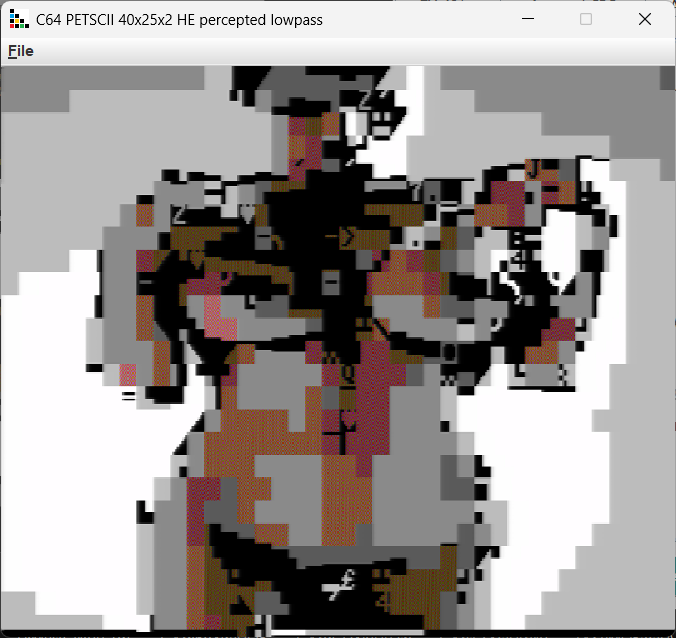
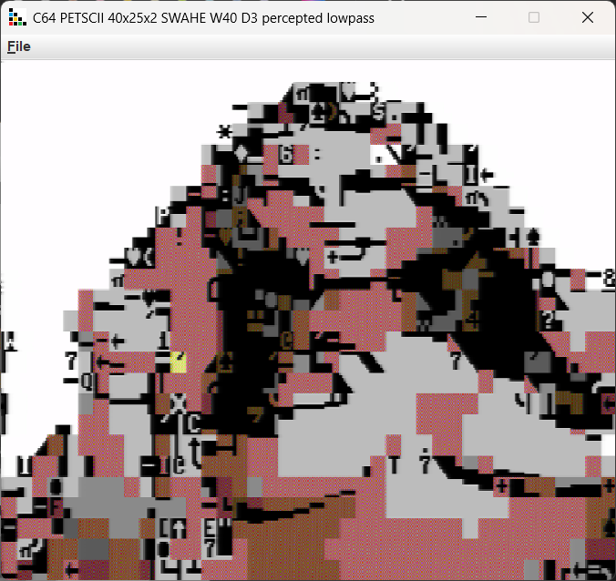
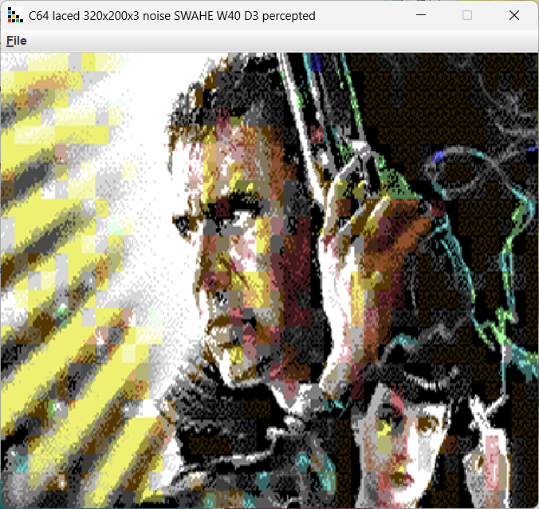
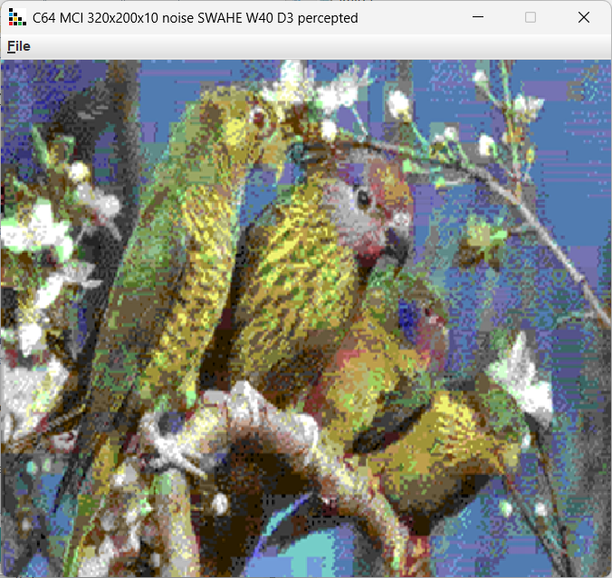

### Commodore C64

16 colors total, 2 modes, 2 useful for graphics

* 320x200 - uses 2 colors in 8x8 screen cell.
* 160x200 - uses 4 colors in 4x8 screen cell, average or brightest color are choosen when shrinking 320->160.

Exports to executable PRG or to Art Studio (hires) and Koala Paint (multicolor).

### PETSCII

16 foreground colors, 1 common background color for every character on the screen. Orginal PETSCII characterset.

Characterset neural matcher with one hidden layer & relu activation. Exports to executable PRG.

Use lowpass filter with threshold to reduce details. More details, harder to produce descent screen.

### Commodore C64 extra

Trick modes, you need to experiment with setting to produce decent picture. Noise dithering works very well with MCI, bayer with Interlaced Hires.

MCI try to avoid pictures with big empty areas.

Converter mode

* Hires interlaced - 3 colors in a cell 8x8
* Multicolor interlaced - 8 colors in a cell 8x8
* Monochrome - reduce colors to 21 shades of gray

Color aproximation for hires interlaced

* linear - most distant colors in RGB cube, preferred
* cube - cube color approximation, more accurate

Flickering for multicolor interlaced (MCI) - eliminate picture flashing.

luma threshold - how far apart can be the brightness of used colors.

Hires interlaced

MCI 
