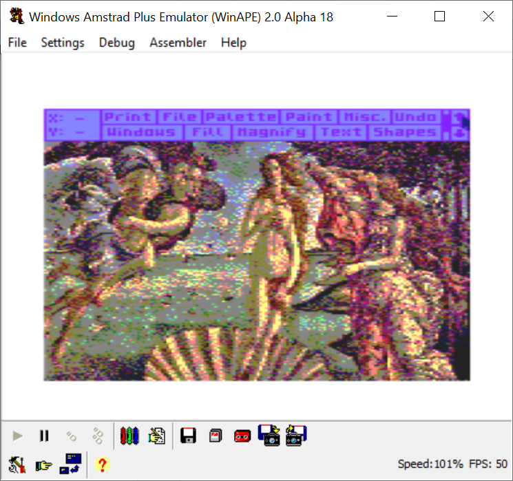

### Amstrad CPC

27 colors total, 3 modes, 2 useful.

* dithering – Bayer or Atkinson dithering, colors of the original picture are replaced by retro machine palette
* high contrast - replaces brightest/dimmest color with white and black

* 320x200 - uses 4 colors on whole screen.
* 160x200 - uses 16 colors on whole screen, average or brightest color are choosen when shrinking 320->160.

Palette is result of Kohonen pixel classification. Exports to Advanced Art Studio with standalone palette file. All files generated with AMSDOS headers.

