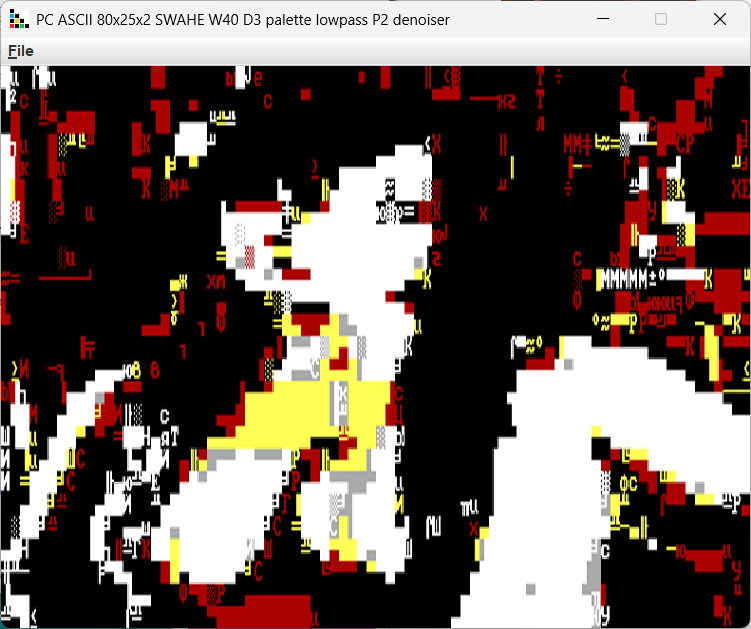
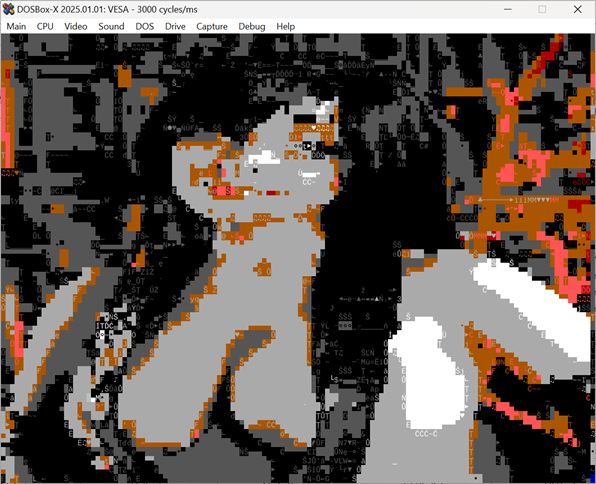

### PC

PC text modes.

* CGA 80x25 - uses max 16 foreground colors, 8 background colors with standard CGA character set.
* VESA 132x50 - uses max 16 foreground colors, 8 background colors with standard CGA character set.

* One hidden layer, relu activation - neural net character matcher with single hidden layer, preffers semigraphics.
* Two hidden layers, relu activation - neural net character matcher with two hidden layers, preffers characters.

Exports to executable COM.

VESA mode on SVGA card

