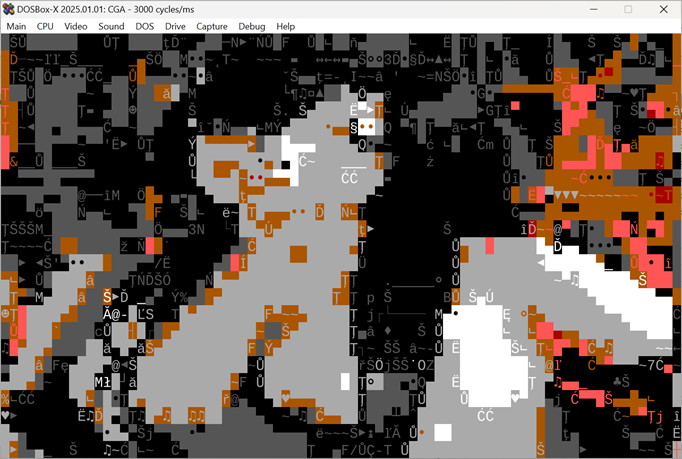

### PC

PC text modes.

* CGA 80x25 - uses max 16 foreground colors, 8 background colors with standard CGA character set.
* VESA 132x50 - uses max 16 foreground colors, 8 background colors with standard CGA character set.

Relu activation with softmax - neural net character matcher with single hidden layer. Works fine with lowpass filter. Exports to executable COM.

VESA mode on SVGA card

