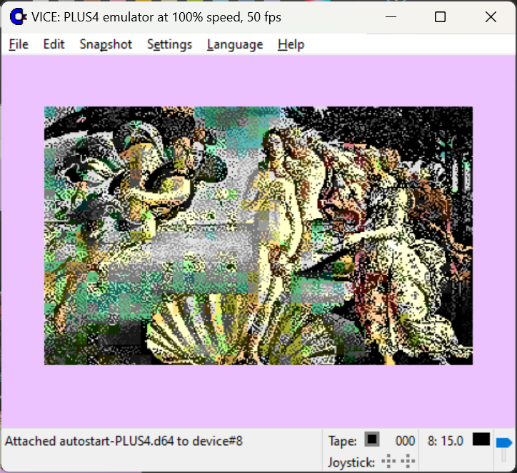

### Commodore Plus4

121 colors total, 2 modes, 2 useful for graphics

* 320x200 - uses 2 colors in 8x8 screen cell.
* 160x200 - uses 4 colors in 4x8 screen cell, average or brightest color are choosen when shrinking 320->160.

Exports to executable PRG.

