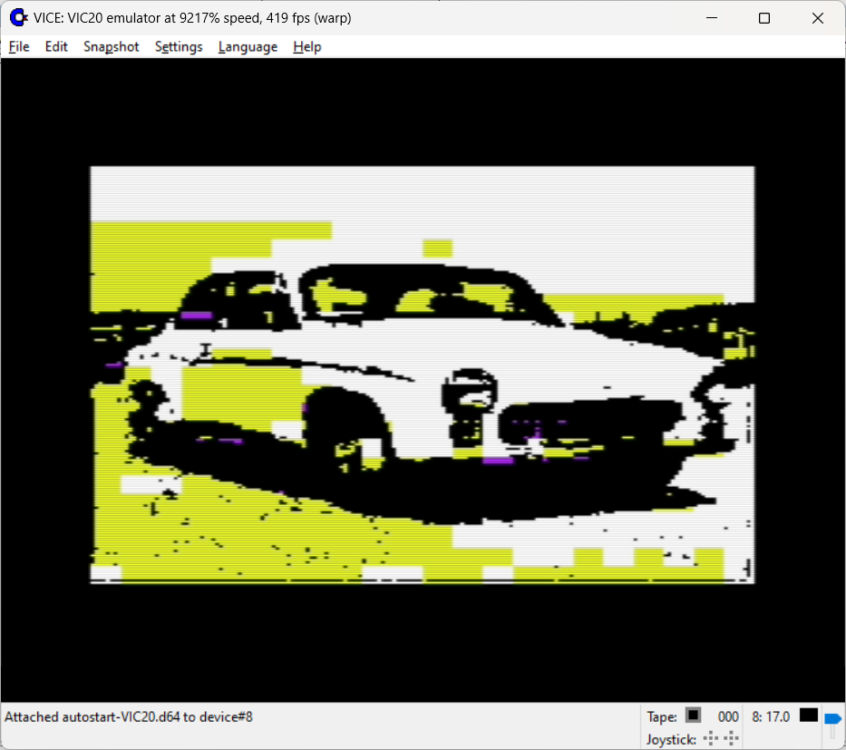
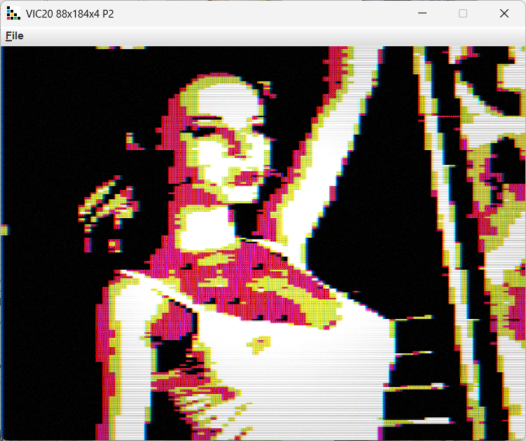

### VIC-20

16 colors total, 1 text mode.

* 176x184 - uses 2 colors in 8x8 grid and neural net regenerated charset, slow
* 88x184 - uses 4 colors (entire screen) and neural net regenerated charset, slow

TIP: Try to use pictures with well balance between empty and filled with photographed objects areas. VIC20 has only 256 characters and all details must fit in this character set. Screen has 506 tiles 8x8 (characters). So most of the picture has to be empty. NN wan't signal you if task is impossible to do.

Use lowpass filter with threshold to reduce details. More details, harder to produce descent charset. Exports to executable PRG.

Pseudographic hires mode - regenerated charset 

Pseudographic lowres mode - regenerated charset 

