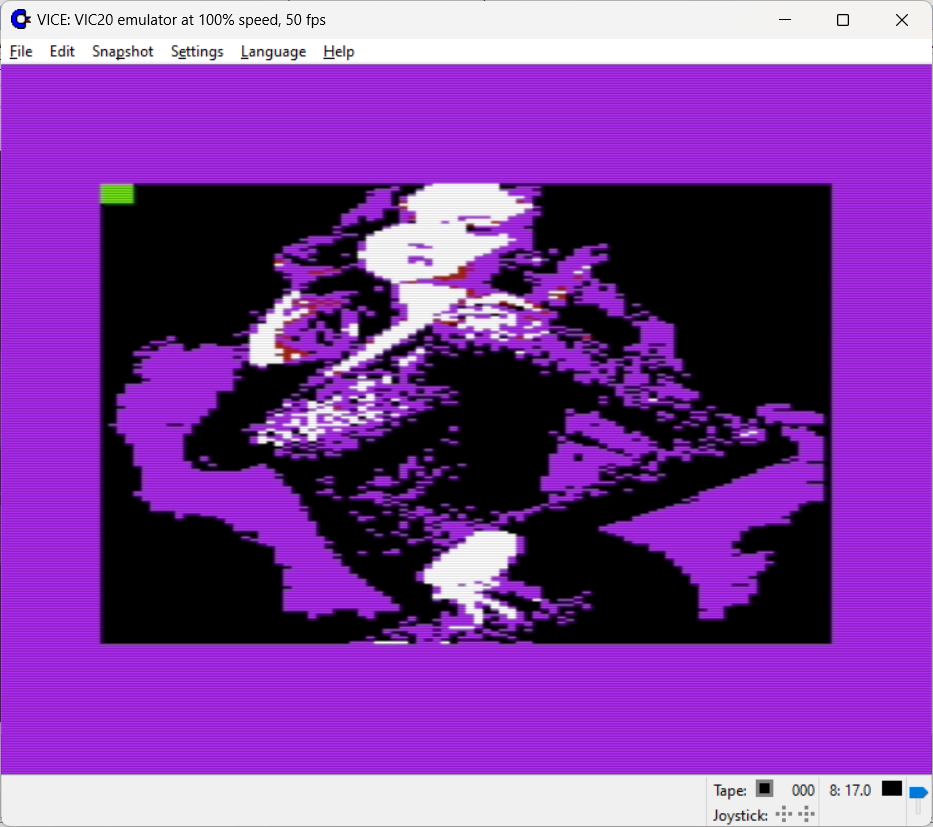

### VIC-20

16 colors total, 1 text mode.

* 22x23 - uses 2 colors - petscii charset.
* 176x184 - uses 2 colors in 8x8 grid and neural net regenerated charset, slow & experimental
* 88x184 - uses 4 colors (entire screen) and neural net regenerated charset, slow & experimental

Use lowpass filter with threshold to reduce details. Exports to executable PRG.

Pseudographic hires mode - regenerated charset 

Pseudographic lowres mode - regenerated charset 

