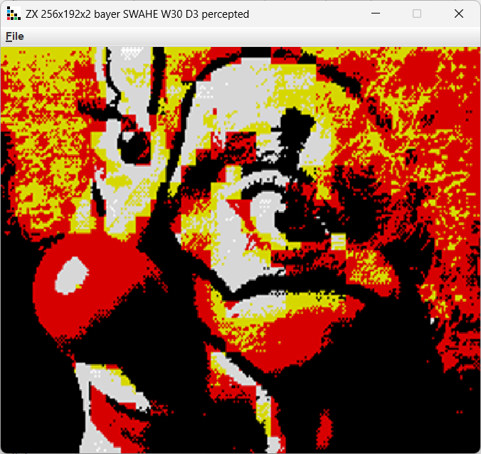

### ZX Spectrum 48/+

16 colors total, 1 screen mode.

* bayer or apple dithering - produces more tinty picture insted of hue explosion.
* 256x192 - uses 2 colors in 8x8 screen cell.

Exports to native SCR snapshoot.

